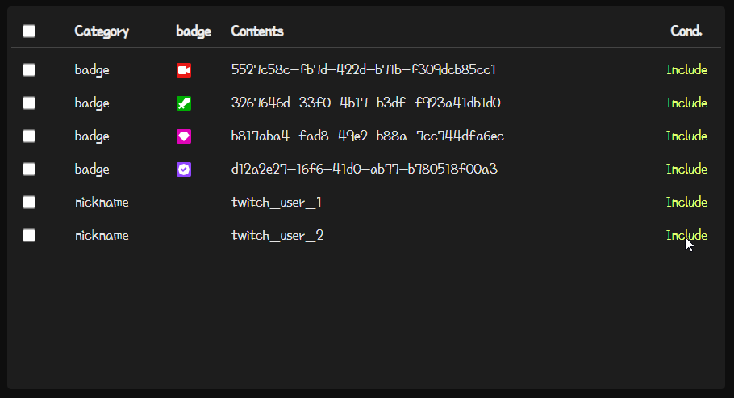

# Twitch Badge Collector

Description for Filter Add-on.

***

## **Add Filter**

### Filter Settings

There are three types of filters.

* Badge Filter
* ID or Nickname Filter
* Keyword Filter

#### ***Add ID***

Enter the ID or nickname of the user you want to add.

#### ***Add Badge***

Enter the image link of the badge you want to add.
Links can be obtained from chats in the Twitch chat window.

> Right-click the badge you want to add in the chat window -> Copy Image Link

Badge Link Example
```
https://static-cdn.jtvnw.net/badges/v1/5527c58c-fb7d-422d-b71b-f309dcb85cc1/1

https://static-cdn.jtvnw.net/badges/v1/b817aba4-fad8-49e2-b88a-7cc744dfa6ec/1
```
You can set notes for badge filter. If not entered, the badge's UUID is the default.

#### ***Keyword Filter***

Enter the keywords you want to add.

> Keywords are not case-sensitive.

#### ***Filter Condition***

Filters can be set in three ways: `Include`, `Exclude`, `Sleep`.

If set to Include, copy the chat; if set to Exclude, do not copy the chat.

> It works in the following order: ID Filter -> Badge Filter -> Keyword Filter.
>
> If the ID filter is set to "Exclude", the rest of the badge and keyword filters are ignored.

***

## **Change Filter Condition**

You can change Filter Condition by clicking the left side of the filter list.



There are three states: Include, Exclude, and Sleep. Instead of deleting the filter, you can set the filter's status to Sleep.

***

## **Delete Filter**

Delete includes "Delete Selections" and "Delete All". You can use the checkbox to the left of the list to select the filter that you want to delete, and then click Delete Selections, or you can delete all filters through "Delete All". (At this time, the default badge Streamer, Manager, VIP, and Verified badges are not deleted.)

***

## **Backup to File**

Click the Backup button to download the list of filters as a .tbc file.

***

## **Apply Backup File**

> CAUTION: Unexpected errors may occur if the backup file is randomly modified and uploaded.

Press the Upload File button, select the .tbc file, and press the OK button to apply the file.

***