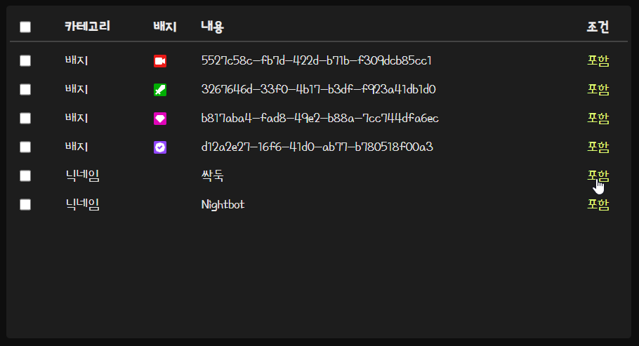

# Twitch Badge Collector

필터 추가 기능에 대한 설명입니다.

***

## **필터 추가하기**

### 필터 세부 설정

필터는 총 세가지 종류가 있습니다.

* 배지 필터
* 아이디 또는 닉네임 필터
* 키워드 필터

#### ***아이디 필터***

추가하고자 하는 유저의 아이디 또는 닉네임을 입력합니다.

#### ***배지 필터***

추가하고자 하는 배지의 이미지 링크를 입력합니다.
링크는 트위치 채팅창의 채팅에서 가져올 수 있습니다.

> 채팅창에서 추가하고자 하는 배지 오른쪽 클릭 -> 이미지 링크 복사

배지 링크 예시
```
https://static-cdn.jtvnw.net/badges/v1/5527c58c-fb7d-422d-b71b-f309dcb85cc1/1

https://static-cdn.jtvnw.net/badges/v1/b817aba4-fad8-49e2-b88a-7cc744dfa6ec/1
```
배지 필터는 메모를 통해 알아보기 쉬운 내용으로 표시할 수 있습니다. 입력하지 않으면 배지의 UUID 가 기본값입니다.

#### ***키워드 필터***

추가하고자 하는 키워드를 입력합니다.

> 키워드는 대소문자를 구분하지 않습니다.

#### ***필터 조건***

필터는 `포함`과 `제외`, `꺼짐` 세 가지 조건으로 설정할 수 있습니다.

포함으로 설정하면 채팅을 복사하고, 제외로 설정하면 해당 채팅을 복사하지 않습니다.

> 아이디 필터 -> 배지 필터 -> 키워드 필터 순서로 작동합니다.
>
> 만약 아이디 필터가 "제외"로 설정되면 나머지 배지, 키워드 필터는 무시됩니다.

***

## **필터 상태 변경**

필터 목록 좌측의 조건을 클릭하여 필터의 작동 조건을 변경할 수 있습니다.


포함, 제외, 꺼짐 세 가지 상태가 있습니다. 필터를 삭제하는 대신 필터의 상태를 꺼짐으로 설정할 수 있습니다.

***

## **필터 삭제하기**

삭제는 선택 삭제와 전체 삭제가 있습니다. 목록 왼쪽에 있는 체크박스를 통해 삭제를 원하는 필터를 선택한 뒤 선택 삭제를 누르거나, 전체 삭제를 통해 모든 필터를 삭제할 수 있습니다. (이때, 기본 배지인 스트리머, 매니저, VIP, 인증 완료 배지는 삭제되지 않습니다.)

***

## **파일로 백업하기**

파일 백업 버튼을 누르면 필터 목록을 .tbc 파일로 다운로드 합니다.

***

## **백업 파일 적용하기**

> 주의 : 백업 파일을 임의로 수정하여 업로드 할 경우 예상치 못한 오류가 발생할 수 있습니다.

파일 업로드 버튼을 누른 뒤 .tbc 파일을 선택한 뒤 확인 버튼을 누르면 파일이 적용됩니다.

***