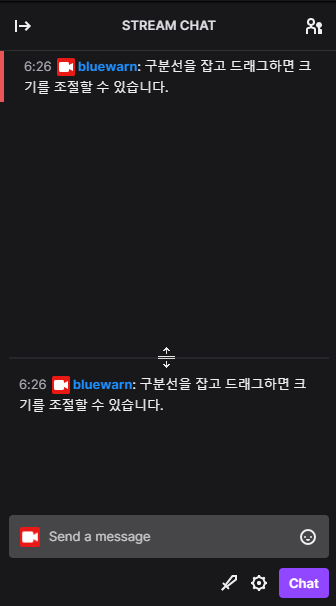

# Twitch Badge Collector

> 트위치 채팅을 보기 쉽게 해주는 확장 프로그램입니다.
> 
> 원하는 채팅을 따로 모아서 볼 수 있도록 도와줍니다.

## **사용법**

### 트위치 채팅창
확장 프로그램을 설치하고 트위치 실시간 방송에 접속하면 아래 사진처럼 채팅창 아래 구분선과 빈 공간이 생성됩니다.

채팅이 설정된 필터 조건과 맞으면 채팅을 복사합니다.

위는 원본 채팅이고 아래는 복사된 채팅입니다.
채팅이 복사되면 해당 채팅의 원본을 쉽게 찾을 수 있도록 채팅 좌측에 표시됩니다.

구분선을 잡아 끌어서 채팅창의 크기를 조절할 수 있습니다.

### 필터 기능 사용하기
[필터 기능 설명서](https://tbc.bluewarn.dev/doc/filter/ko/filter_manual.html) 를 참고하세요.

## **더보기**

> [이메일](mailto:n5lp97@gmail.com) 
> [지원](https://chrome.google.com/webstore/detail/twitch-badge-collector/gnkpenemgdhdckabddlbcjlhplmhlhoj/support) 
> [리뷰](https://chrome.google.com/webstore/detail/twitch-badge-collector/gnkpenemgdhdckabddlbcjlhplmhlhoj/reviews)

***

